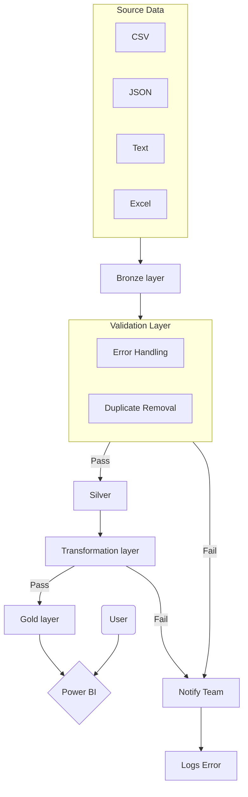

# Medallion Architecture - Group 1

## Task

Create a Mermaid diagram showing how this pipeline should be organised into Bronze, Silver and Gold layers.

Your diagram should show:

- source data
- Bronze layer
- Silver layer
- Gold layer
- at least one data quality or validation step
- at least one final output for a user or stakeholder

## Diagram

## Questions to answer:

### One design decision
- We decided to do a 'Top Down' diagram view, as this allows for a scalable design as more steps are added.
- Changed the 'box' shapes depending on if it is a processing step, or user/power Bi
- Grouped the Source data and Validation Layer for cleanliness

### One question or risk
- We are unsure about...
