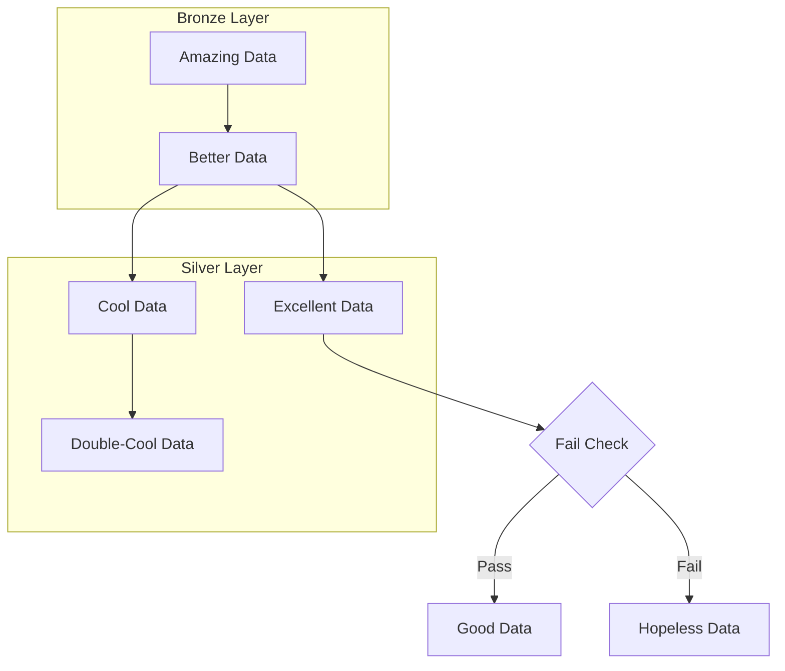

# Pipeline Architecture Diagram

```mermaid
flowchart TD
  A[Amazing Data] --> B[Better Data]
  B --> C[Cool Data]
  C --> D[Double-Cool Data]
  B --> E[Excellent Data]
  E --> F{Fail Check}
  F -->|Pass| G[Good Data]
  F -->|Fail| H[Hopeless Data]

  subgraph Bronze[Bronze Layer]
    A
    B
  end

  subgraph Silver[Silver Layer]
    C
    D
    E
  end
  
```

```python
print("Hello Mum!")
```

```text
This is text
```